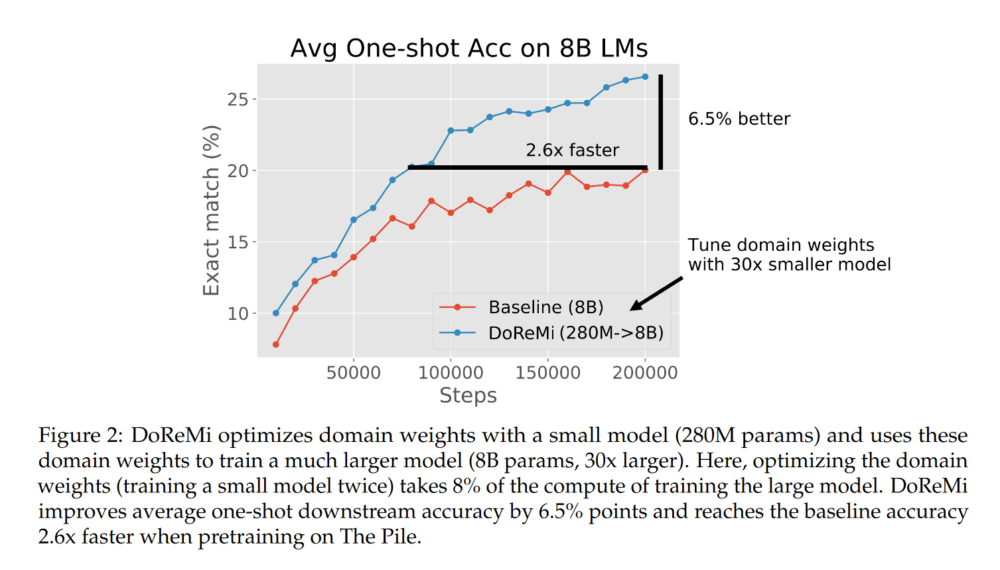
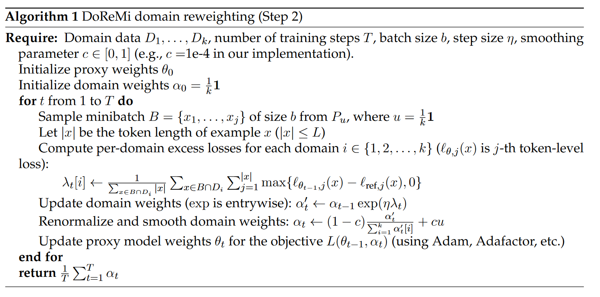
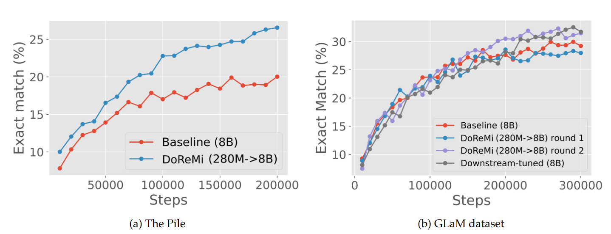
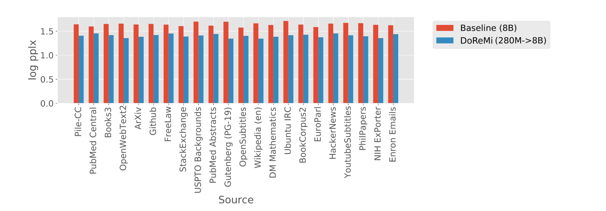
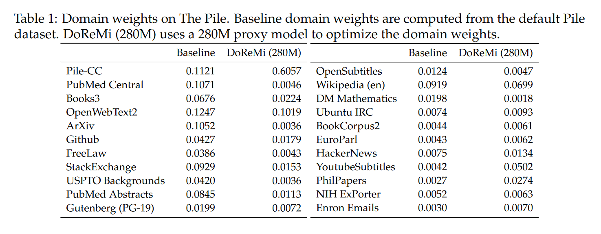
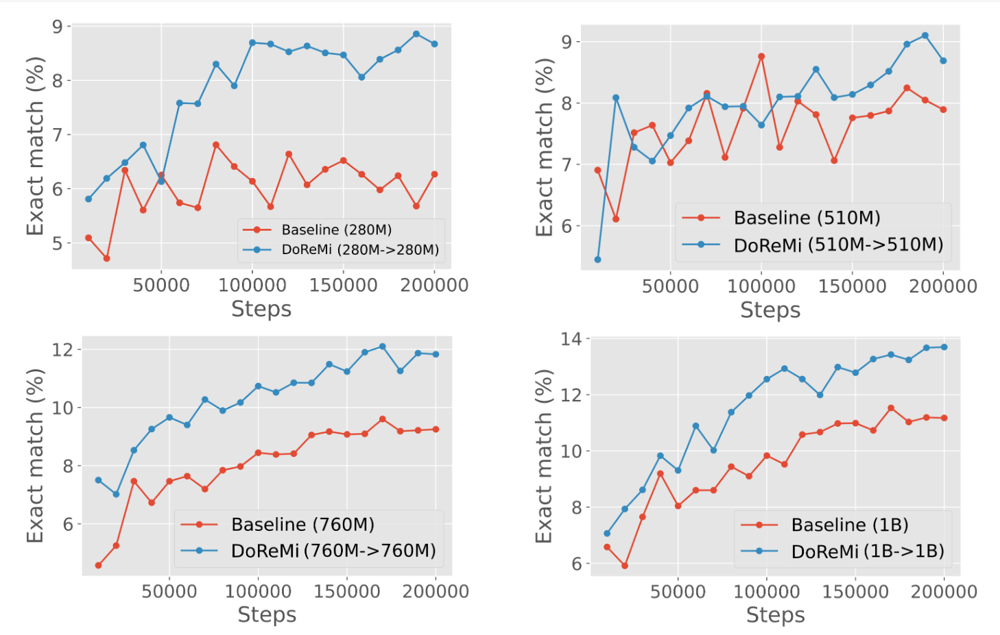
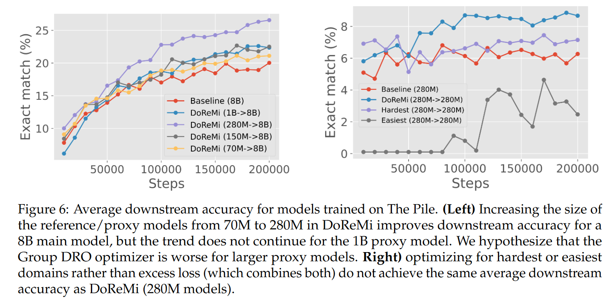

# DoReMi: Optimizing Data Mixtures Speeds Up Language Model Pretraining

## Abstract
预训练数据领域的混合比例对语言模型的性能有很大影响. 本文中, 我们提出了使用极大极小化的领域重加权的方法, 首先使用group distributionally robust 优化, 在不知道下游任务的知识的情况下, 训练一个==small proxy model==, 来生成==领域权重/domains weights/mixture proportions==. 然后我们使用领域权重, 重采样了一个数据集, 来训练一个更大的的模型.
在实验中, 使用280M的代理模型来获得领域权重, 来训练一个8B的模型.
DoReMi在所有的领域内提高了困惑度, 即使对那些权重下降的领域. 相比于模型的权重领域, 提高了下游任务准确度, 大约6.5%, 同时将计算步数减少了2.6x. 
在GLaM数据集上, DoReMi, 在不知道下游任务的情况下, 性能与那些在下游任务上调整权重的方法相当.
{:width=0 height=300}

## Introduction
用于训练大预言模型的数据集, 通常都是从多个领域内混合抽样的. 比如, The Pile, 一个大型公开数据集, 由24%的web数据, 9%的Wikipedia, 4%的Github. 预训练数据的组成, 会影响语言模型的有效性. 然而, 如何配比数据, 以在多个下游任务上提高性能. 现有的方法通常是通过, 基于直觉(intuition)或下游任务的. 
- 比如, The pile使用启发式选择领域权重, 有可能是sub-optimal的. 
- 另一方面, 现有的PaLM, GLaM根据一组下游任务(Downstream tasks)的调整领域权重, 但这需要在不同的领域上训练数千个LMs, 并存在过拟合特定下游任务数据集的风险.

与在一系列下游任务上优化领域权重不同, 我们方法的意在找到一个领域权重, 以提高在==所有领域上的性能==, 通过优化worst-case loss. 由于每个领域有一个不同的优化loss, 一个naive的方法是优化噪音最大的数据的领域. 为了让不同领域的perplexity可比, 我们优化了==最坏情况下的超额损失worst-case excess loss==, 即正在评估的模型与预训练参考模型之前的损失差距.
DoReMi, 在不知道下游任务的情况下, 使用DRO(distributionally robust optimization)来调整领域权重. 首先训练一个小的参考模型. 然后, 训练一个小的DRO模型, 最小化worst-case excess loss. 需要注意的是, 不使用这个robust LM, 我们使用DRO训练产生的领域权重. 最后基于权重训练了一个8B模型.
我们的方法使用了DRO-LM框架来优化领域权重, 而非生成一个Robust模型. 为了这么做, 我们使用了一个在线学习优化器, 能够动态的更新领域权重, 根据每个领域上的损失. 最后, DoReMi使用了在DRO训练步骤中的平均权重.

## Domain Reweighting with Minimax Optimization (DoReMi)
#### Set up: 
假设目前有$k$个领域(比如Wikipedia, Github), 每个领域$i$, 有数据$D_i$. 领域权重$\alpha \in \Delta^k $, 定义了一个在k个领域上的概率分布. 进而得到训练数据上的分布: $P_\alpha = \sum _{i=1} ^k \alpha_i * \operatorname{unif}(D_i)$, 其中$\operatorname{unif}(D)=\frac{1}{|D|}\sum_{x\in D}\delta_x$.
>这里意思时根据领域的权重, 再给每一条数据分配权重.

#### DoReMi

DoReMi的输入是数据$D_1, ..., D_k$, 参考领域权重 $\alpha_{ref}$, 以及训练超参数(训练步数 T, batchsize b). DoReMi返回优化后的领域权重$\bar \alpha$, 最终, 一个在$P_{\bar \alpha}$上训练的语言模型.

- Step1: 得到一个小的参考模型. 首先训练了一个模型$p_{ref}$, 以一些参考领域权重$\alpha _{ref}$(e.g. 默认的平均领域权重). 

- Step2: 使用Group DRO训练一个代理模型, 得到领域权重. 为了得到领域权重, 训练了一个小的代理模型$p_\theta$, 使用DRO-LM框架和Group DRO优化器. 其中$\theta$是代理模型的权重. 这个框架训练了一个robust model通过优化worst-case loss over domain, 即下列极小极大目标:
$min_{\theta} max_{\alpha \in \Delta ^k} L(\theta, \alpha) = min_{\theta} max_{\alpha \in \Delta ^k} \sum_{i=1}^k \alpha_i * [\frac{1}{\sum_{x\in D_i}|x|} \sum_{x\in D_i} l_\theta(x)-l_{ref}(x)]$
$l_\theta(x)-l_{ref}(x)$超额损失, 衡量了在对应数据/领域上改进的潜力. 
Group DRO优化器, 交替的进行==领域权重$\alpha_t$上的梯度上升==和==代理模型权重$\theta_t$的梯度更新==. 该优化器差额loss比较高的领域的权重, 提高代理模型梯度更新时在这些领域中数据的权重. 最后返回训练轨迹中权重的均值$\bar \alpha = \frac{1}{T}\sum_{i=1}^T\alpha_t$.

{:width=0 height=300}

- Step3: 使用新的领域权重训练大语言模型. 

#### Iterated DoReMi
DoReMi的输入是$\alpha_{ref}$, 输出是$\bar \alpha$. 通过多次迭代使用DoReMi指导$\alpha$收敛. 经验上使用三个epoch.

## DoReMi Improves LM Training Efficiency and Performance
#### Experimental setup
- The Pile Dataset: 800GB, 22domains. 模型权重是启发式决定的. 我们使用默认权重来训练baseline.
- GLaM数据. 8个领域. GLaM根据下游任务调整权重.

- evaluation: 留出验证集来度量每个领域上的困惑度. 下游任务上, 使用one-shot.

- 用于优化权重的计算消耗: 两个280M的模型, 计算消耗为主要8B模型的8%.

#### Result
{:width=0 height=250}
The pile下游任务上, 平均高出6.5个点, 同时速度是2.6倍.
GLaM是在下游任务上微调的, 性能几乎相当.

{:width=0 height=250}
domain上的perplexity, 即使某些领域权重下降, 仍然提高了perplexity.

{:width=0 height=250}
The Pile上默认和DoReMi计算出来的权重

{:width=0 height=200}
GLaM上默认和DoReMi计算出来的权重

## Ablation Study

- 模型大小的影响: 简化实验, 让代理模型和主要模型相同大小. 不同大小下, 一致的提高了下游任务准确率
{:width=0 height=300}
- 相同大小下, 代理模型不如主模型
- 代理模型的大小的影响. 固定主要模型8B, 代理70M, 150M, 280M, 1B.
- 如果不使用reference模型, 仅考虑loss绝对值, 那优化最难领域(loss最大)或最简单领域(loss最小)都不如DoReMi.
{:width=0 height=300}