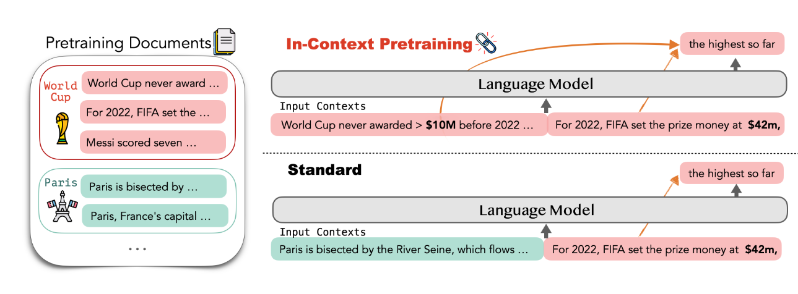
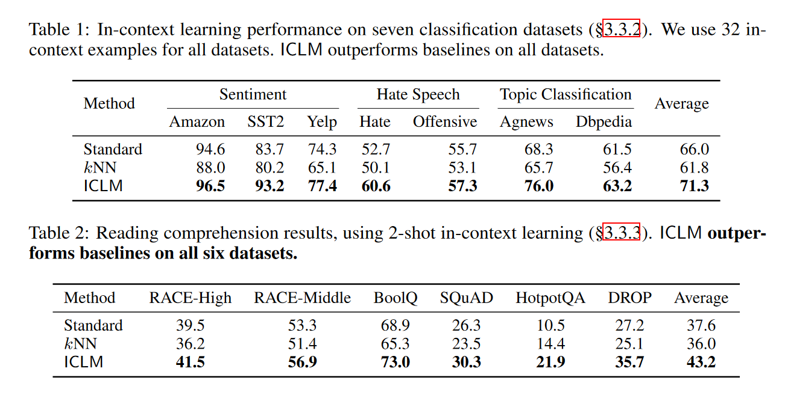
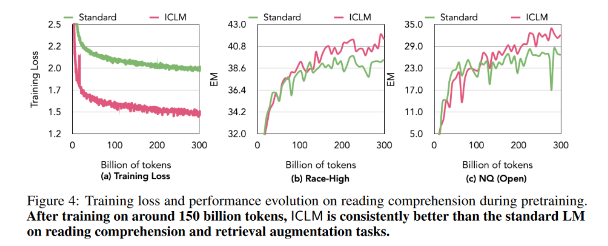

# IN-CONTEXT PRETRAINING: LANGUAGE MODELING BEYOND DOCUMENT BOUNDARIES
KEYWORDS: [continue pretraining]; [pretraining]

## Review

- 调整了训练数据的顺序, 有比较好的效果.

## Introduction
LLMs训练用的语料很广. LLMs有时很难理解复杂的上下文, 无法准确遵循指令, 在有条件的文档上推理困难, 并且在上下文学习中表现出高方差.
提出了In-context pretraining, 根据一系列相关文档预训练, 使得模型能够阅读和推理更多样和更长的上下文, 并且突破文档之间的界限.
过去的预训练, 将随机选择的短文档拼接起来, 以创建更长的上下文窗口. 但是, 不同文档之前没什么关系. 上下文预训练则将语义相关的文档拼接起来, 提供跨文档的预训练信号. In-context pretraining只改变文档的顺序, 不改变其他方面.
当时, 文档排序问题是比较有挑战性的. 用了两种近似算法解决这些问题. 使用一个检索模型, 以及一个高效搜索索引配对, 构建了一个文档图, 相连的文档语义相近. 然后转化为旅行商问题.

## Method
#### 寻找相关的文档.
对于每个文档$d_i$, 在语料中找到最近的k个, $N(d_i)$.
使用近似最近邻搜索, 可以在任意两个文档进行成对相似性比较.
使用了==近似最近邻搜索, product quantization, 逆文件FAISS索引==的技术.

#### 构建输入上下文
给定一个图$D=\{d_i\}$, 以及每个文档的临近点$N(d_i)$. 希望形成一个输入上下文$C_1, ..., C_m$的集合, 其中每个上下文$C_i={d_1,...,d_k}\subset D, \cup C=D$. 每个$C_i$中的文档都是高度相关的.
转化为TSP问题, 贪心算法解决了.

## 实验
#### baseline
- standard
- kNN: 重复度高
- ICP
#### 结果

## 分析
追踪了在训练过程中, ICP和standard在训练loss和任务表现上的差别
