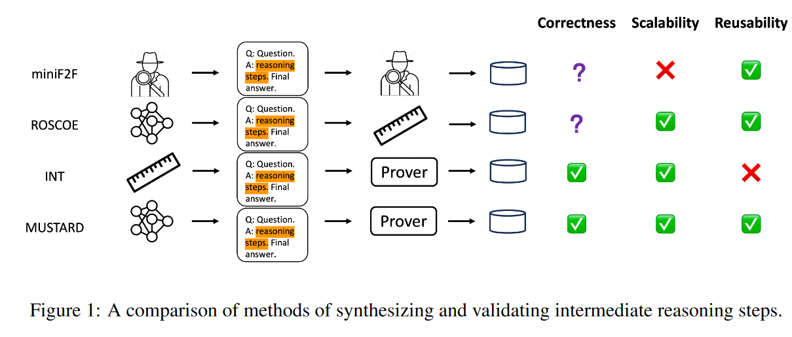

# MUSTARD: MASTERING UNIFORM SYNTHESIS OF THEOREM AND PROOF DATA

## Abstract
提出了MASTARD框架, 生产高质量和高随机性. 三个阶段
- 采样了一些数学概念
- 使用语言模型生成了一些数学问题, 以及它的informal证明, formal证明.
- 使用lean prover来筛选出有效的证明.
根据以上框架生成了7335个有效的数据. 

## Introduction

一些其他产生数据方法.

## Method
#### concept seeding
- 尽可能全的包含eduction level和数学子领域内的数学概念
- 从中选取1-2个数学概念

#### 