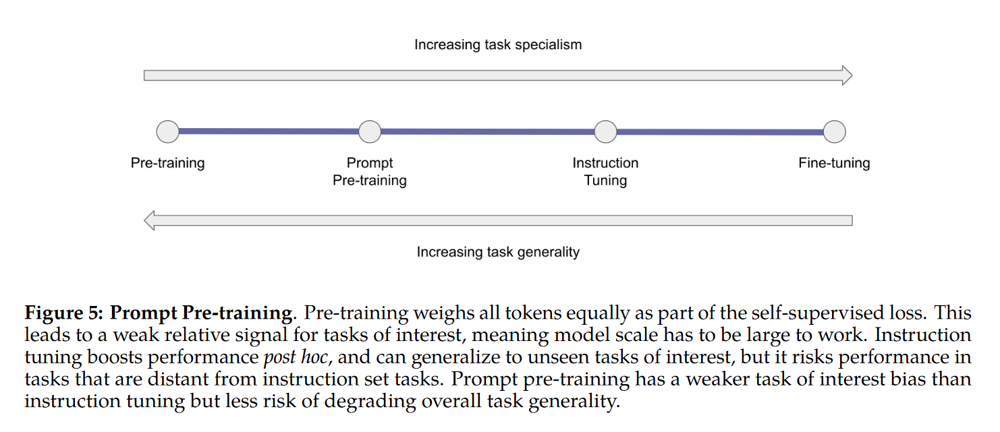
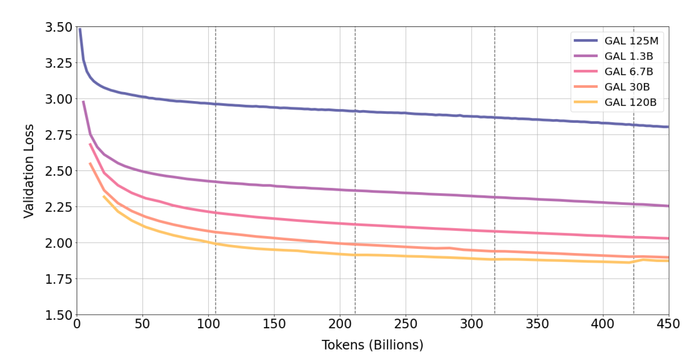

# Galactica: A Large Language Model for Science

## Abstract
信息过载是一个问题, 目前使用搜索引擎很难独立组织科学知识. 本文提出了Galalctica, 是一个能==储存, 组合和推理==科学知识的LLM. 对大量的科学文献, 参考资料, 知识库进行了训练. 
在推理任务上去取得不错的表现, MMLU=41.3; Math=20.4.
Knowledge-instensive任务中表现得特别好.
高质量重复token上训练可以改善上下游性能

## Dataset
#### Tokenization
做了一些特殊的tokenization: (比如数学中对于数最好按照单个数字划分). 还有DNA序列, 引用之类的.
- Working Memeory Token: 将step-by-step的推理步骤放在\<work>\</work>中. 一些数据是编程, 当执行人类无法完成的计算时, 编写并执行python脚本.
- citation token
#### Prompt Pre-Training
在本文中, 我们选择通过更多的task-specific prompt来增强预训练数据, 提高小规模下的性能. 可以让模型直接用于一些问答, 摘要问题. 最后, 通过将prompt和一般数据一起使用, 我们提高了模型的泛化性.

## Method
- gelu
- context window = 2048
- no bias
- learned positional embedding
- BPE

## Result
我们发现验证集loss曲线在第5个epoch还在下降, 说明第5个epoch才过拟合.

为什么过拟合现象没那么严重呢, 1 质量因素; 2 模态因素, 科学数据的性质使得每个token价值更高.
