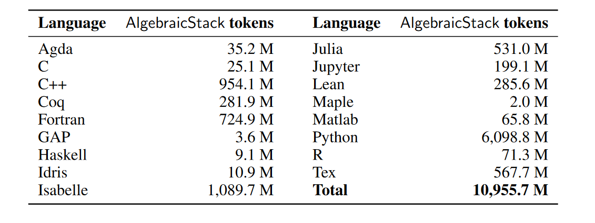
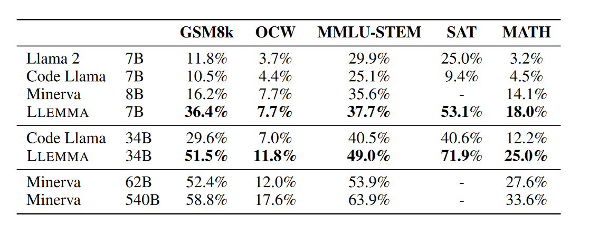
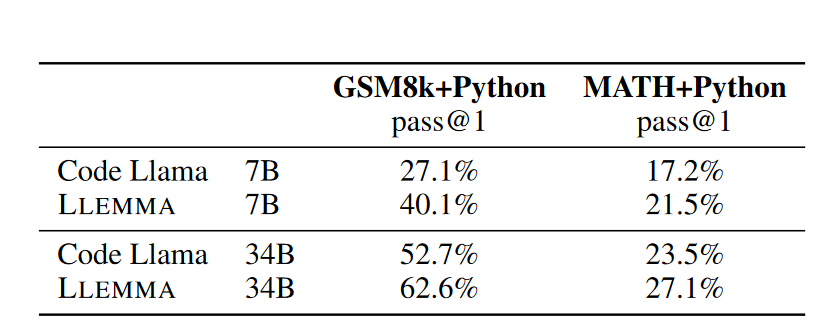
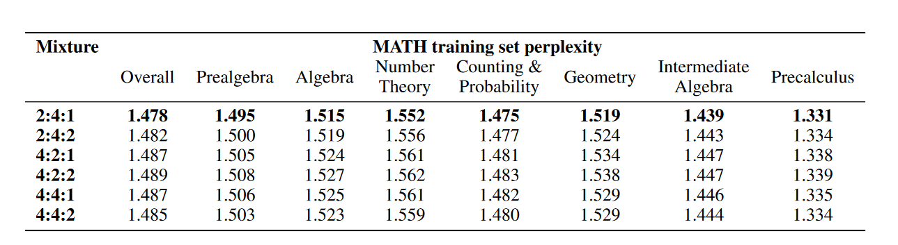
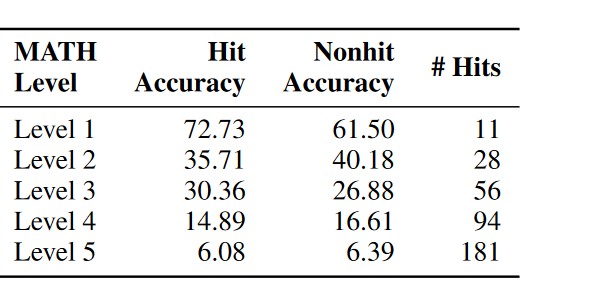

# LLEMMA: AN OPEN LANGUAGE MODEL FOR MATHEMATICS
KEYWORDS: [continue pretraining]; [pretraining]; [math]; [tool].
## Review

- 开源了数据非常不错
- 数据混合的比例没有深入探究, 很可惜, 是否能监控一下在测试集上的准确率

## Motivation
- 解决数学问题
## Conclusion
- 一个55B数据集
## Introduction
7/34B CodeLLaMA上续训练, 使用Proof-Pile-2数据集.

## Approach
### Data: Proof-Pile-2
55B-token, 包括 scientific papers, web data containing math, math code.
- Code
  - AlgebraicStack, 11B token, 包含17种语言, 从数值, 符号到形式数学. 来自Stack, public GitHub仓库, 形式证明数据.
  - 
- Web Data
  - OpenWebMath, 15B高质量web网页数据
- Scientific papers
  - RedPajama的Arxiv子集(RedPajma是LLaMA训练数据的复现版本), 包含29B
- General data
  - 混合了5%其他领域的数据

### Model and Training
- 7B 200Btokens, 34B 50B tokens

## Evaluation
### few-shot + CoT

### with tool
相比于Code Llama有提高
{:width=0 height=150}

### Formal数学

### 数据混合
短期训练, 然后在math-training测试困惑度. 用困惑度最低的作为超参数

#### 数据记忆/污染
- 是否有数据污染
    -   30gram, 训练数据与math-test是否有不同的
    -   7%的problem, 0.6%的solutions
    -   采样了100个问题有污染的, 其中41个没有回答, 49个有与gt不同的solution,但是答案正确.
- 是否会影响结果
  - {:width=0 height=130}
  - 高难度下并不影响结果.