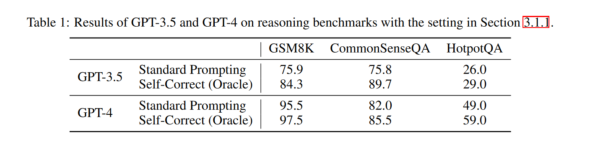
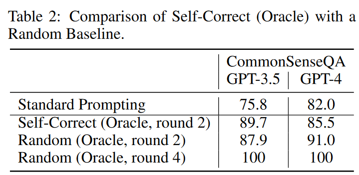

# LARGE LANGUAGE MODELS CANNOT SELF-CORRECT REASONING YET

## Motivation

## Conclusion

## Abstract
大语言模型在各种应用上都很厉害. 尽管如此, 人们仍然关注其生成内容的适当性和准确性. 而一种叫做==self-correction==的方法被提出来解决这些问题. 
文本对self-connection进行了批判性审查, 揭示了其潜力和局限性. 核心是自我矫正的概念,即LLM试图仅基于其固有的能力来矫正它的初始相应,而不基于任何外部反馈. 
在推理的背景下, 我们发现LLMs很难进行自我矫正, 有时矫正的结果甚至导致性能下降.

## Introduction
人们非常关系LLMs输出内容的准确性等.

Self-correction被视为一种关键的技术. 但一个悖论是, 如果LLMs能够self-correct, 为什么不一开始就输出正确的答案呢. 
首先我们定义了intrinsic self-correction, 模型纠正初始相应, 仅仅基于故有能力, 而非外部反馈. 因为高质量的外部反馈很难获得.
与之前的结论不同, 我们发现self-correction反而会降低质量. 之前研究中==self-correction的改进可能是由于oracle==, 当没有oracle时, 改进就会消失. 
还探究了多智能体辩论, 该方法效果不如self-consistency. 

虽然LLMs在reasoning方面不行, 在修改风格/提高回答的恰当性方面确实有偶用. ==我们将自我矫正视为一种post-hoc prompting, 其中prompting涉及到LLMs的response.==. self-correction真正有用的情形是, LLMs产生了忽略prompt中某些内容的反馈. 此外, self-correction的提示可能因为初始指令不够好, 而反馈比较好. 这个时候如果把反馈整合到初始指令中, 反而在降低推理成本的同时提高了效果.

## BackGround
感知机也算self-correction.
强化学习也是. 
LLMs的则是, ==在推理阶段进行self-correction==. 

## CAN LARGE LANGUAGE MODELS SELF-CORRECT REASONING?
大语言模型是否能自我矫正推理.

#### Self-correction with oracle feedback
- setup
  - benchmark: GSM8K / CommonSenseQA / HotpotQA
  - Prompt: (1) 要求产生初始response; (2) 要求review自己的回答, 并且做出反馈; (3) 要求根据反馈再次回答原问题.
  - Test Models: (1) GPT-3.5-Trubo (2) GPT4
  - ==最多两轮self-correction, 同时使用ground truth判断是停止还是继续self-correct==
- results
  - 
- reflection
  - {:weight=0 height=150}
  - random: 第一个答案LLMs选择, 后续随机选择, 直到与ground truth相同停止.
  - 发现random在两轮的时候和self-correction相当(也是两轮)
  - 1. oracle self-correction的问题很大(和random相当), 
  - 2. oracle在数学推理任务上算是作弊, 因为当需要LLMs解决数学任务时, 不会有label(oracle)

#### Intrinsec self-correction
不使用oracle, 而是用两轮self-correction之后的解决来评估表现.
