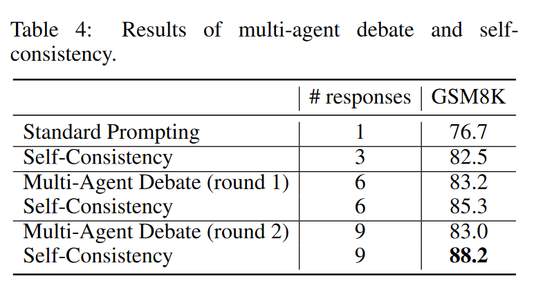

# LARGE LANGUAGE MODELS CANNOT SELF-CORRECT REASONING YET

## Review
厉害的, 很具有洞察性, 能看出用了oracle. 批判性思维很重要

## Motivation
- self-correction能提高性能, 为什么不在一开始就输出正确答案呢.
## Conclusion
- self-correction对推理没有提升
  - 以前来自oracle, 如果没有oracle(指导什么时候停止self-correction), 实际没有提升
  - multi-agent debate实际上是self-consistency, 和 majority voting相同.
- self-correction在一些其他任务上可能有提升
- 但事前提升prompt质量比self-correction(post-hoc prompting)成本更低, 效果更好.

## Abstract
大语言模型在各种应用上都很厉害. 尽管如此, 人们仍然关注其生成内容的适当性和准确性. 而一种叫做==self-correction==的方法被提出来解决这些问题. 
文本对self-connection进行了批判性审查, 揭示了其潜力和局限性. 核心是自我矫正的概念,即LLM试图仅基于其固有的能力来矫正它的初始相应,而不基于任何外部反馈. 
在推理的背景下, 我们发现LLMs很难进行自我矫正, 有时矫正的结果甚至导致性能下降.

## Introduction
人们非常关系LLMs输出内容的准确性等.

Self-correction被视为一种关键的技术. 但一个悖论是, 如果LLMs能够self-correct, 为什么不一开始就输出正确的答案呢. 
首先我们定义了intrinsic self-correction, 模型纠正初始相应, 仅仅基于故有能力, 而非外部反馈. 因为高质量的外部反馈很难获得.
与之前的结论不同, 我们发现self-correction反而会降低质量. 之前研究中==self-correction的改进可能是由于oracle==, 当没有oracle时, 改进就会消失. 
还探究了多智能体辩论, 该方法效果不如self-consistency. 

虽然LLMs在reasoning方面不行, 在修改风格/提高回答的恰当性方面确实有偶用. ==我们将自我矫正视为一种post-hoc prompting, 其中prompting涉及到LLMs的response.==. self-correction真正有用的情形是, LLMs产生了忽略prompt中某些内容的反馈. 此外, self-correction的提示可能因为初始指令不够好, 而反馈比较好. 这个时候如果把反馈整合到初始指令中, 反而在降低推理成本的同时提高了效果.

## BackGround
感知机也算self-correction.
强化学习也是. 
LLMs的则是, ==在推理阶段进行self-correction==. 

## CAN LARGE LANGUAGE MODELS SELF-CORRECT REASONING?
大语言模型是否能自我矫正推理.

#### Self-correction with oracle feedback
- setup
  - benchmark: GSM8K / CommonSenseQA / HotpotQA
  - Prompt: (1) 要求产生初始response; (2) 要求review自己的回答, 并且做出反馈; (3) 要求根据反馈再次回答原问题.
  - Test Models: (1) GPT-3.5-Trubo (2) GPT4
  - ==最多两轮self-correction, 同时使用ground truth判断是停止还是继续self-correct==
- results
  - 
- reflection
  - {:weight=0 height=150}
  - random: 第一个答案LLMs选择, 后续随机选择, 直到与ground truth相同停止.
  - 发现random在两轮的时候和self-correction相当(也是两轮)
  - 1. oracle self-correction的问题很大(和random相当), 
  - 2. oracle在数学推理任务上算是作弊, 因为当需要LLMs解决数学任务时, 不会有label(oracle)

#### Intrinsic self-correction
不使用oracle, 而是用两轮self-correction之后的解决来评估表现.
- {:width=0 height=130}
- 模型性能不升反降
  - Empirical Analysis: 
    - 
    - 从self-correction前后来看: GSM8K大部分没有改变, 改变部分略微倾向于把正确的改错. CommonSenseQA把正确的改错非常明显, 可能是由于选择题中, 错误的选项和题目相关, 让模型再选择一遍是有一定的偏见的(预设了之前不对). ==oracle就是防止将正确答案改错, 所以有明显的性能提高==
  - Intuitive Explanation: 如果模型well-aligned并且使用一个好的prompt, 那么初始的回答应该就是最优的. 引入反馈可以看成是一个额外的提示, 让模型偏向这个提示组合, 但这在推理问题中没有优势, 反而会让性能下降.
- 是不是使用的prompt不够好
  - 也许能找到一个在benchmark上效果好的提示, 但是这并不是intrinsic self-correction, 因为使用了人类的反馈.

#### 多智能体辩论与自一致性/Multi-Agent debate and self-consistency
多智能体辩论也算是self-correction的一种. 通过单个GPT模型的多个instance, 互相辩论. 
{:height=0 width=300}
可以发现, 相同response数目下, mutli-agent要差于self-consistency.
实际上, 虽然这两个方法让模型的性能有提升, 但是这两个方法都不算真正的self-correction, 而是self-consistency. 

## SELF-CORRECTION AS POST-HOC PROMPTING
推理方法不行, 但是某些领域可以.
self-correction=post-hoc prompting 事后prompt
对应 pre-hoc prompting 事前提示
self-correction有价值的部分在于, 事后prompt可以提供事前prompt提供不了的一些信息. 
如果目前是让回答更加安全, 那么使用事前提示可能很难一次就生成无风险的回答, 所以self-correction有用.
> 这和推理问题中的self-correction的本质区别是什么.

优化pre-hoc prompting比self-correction成本更低

设计了一实验: 给出一个concept列表, 生成与其相关的连贯的句子.
- previous works没有明确要求模型要包含所有的概念, 而是通过让模型找确实的概念, 指导模型引入这些概念(即在包含concept方面 self-correct)
- paper中直接要求模型包含所有的概念
- paper中直接要求性能好于self-correction

## Discussion
- self-correction有助于使相应于某些偏好一致, 比如改善风格/增强安全性
- 使用外部反馈. 比如使用搜索引擎, 计算器, code interpreter.
- self-consistency是自我验证的一种方法.
- pre-hoc比post-hoc prompting成本更低