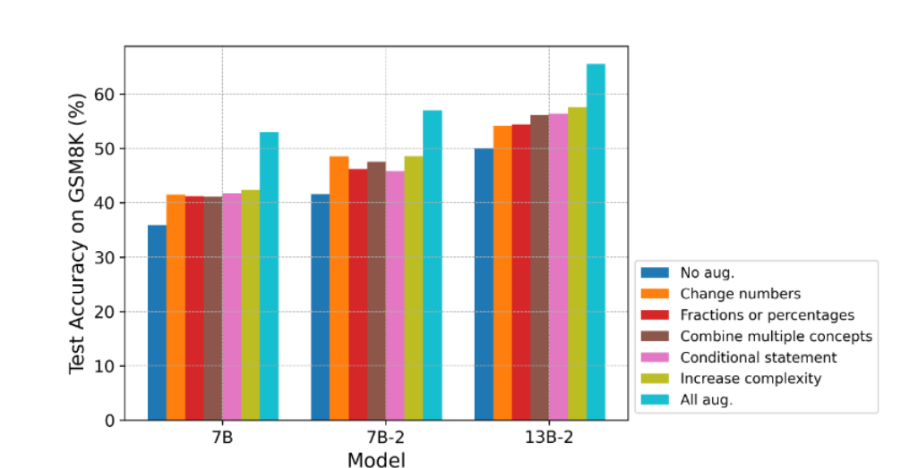
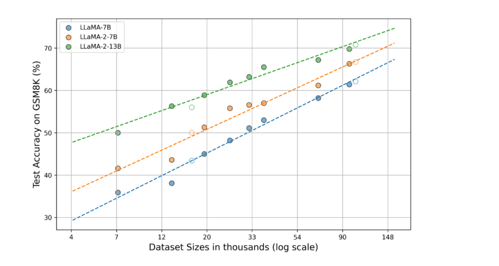
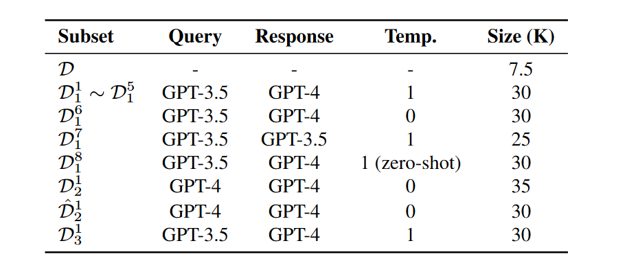
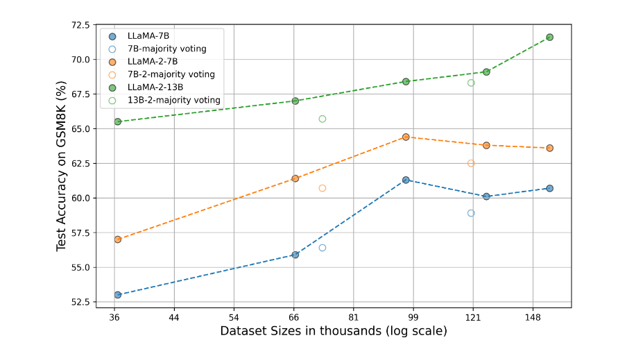
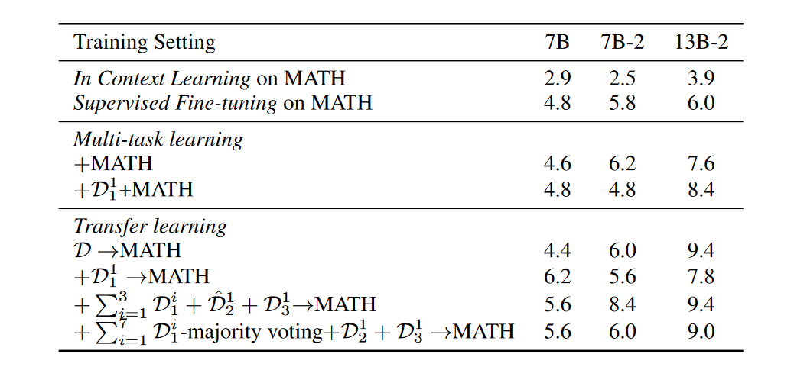
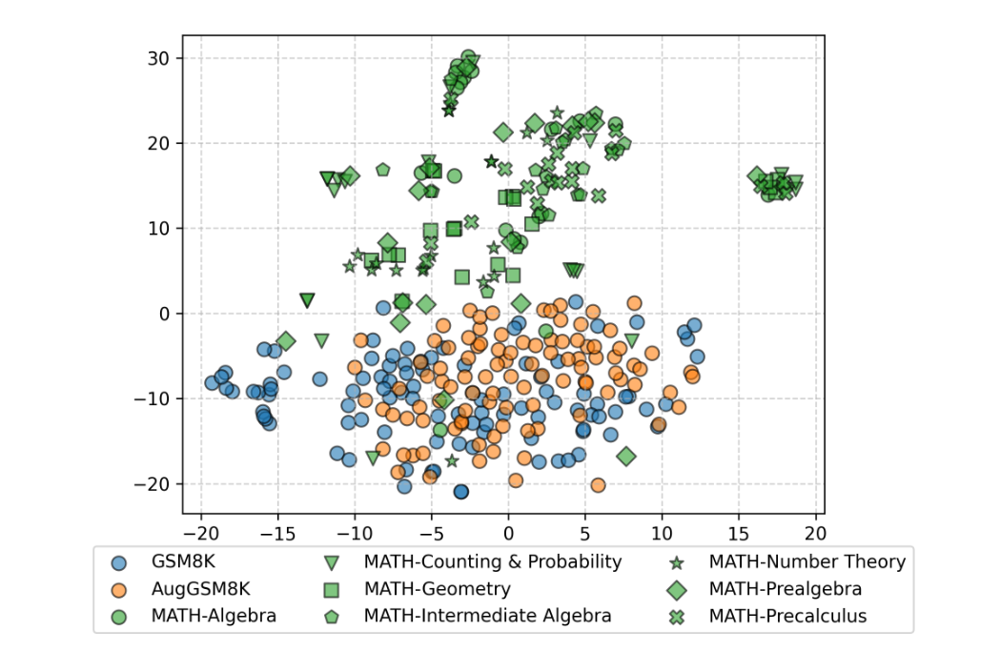
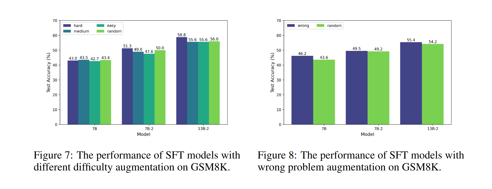

# Query and Response Augmentation Cannot Help Out-of-domain Math Reasoning Generalization

## Motivation
1. 何种数据增强==策略==最有效
2. 数据增强的==数目==与模型表现之间的关系
3. 数据增强对域外的数学推理任务有帮助吗

## Conclusion
1. 在以下5种方法中，==加大难度==效果最好
    - Change specific numbers 改变某些数字; 
    - introduce fractions or percentages 引入分数; 
    - combine multiple comcepts 多种概念; 
    - include a conditional statement 条件陈述; 
    - ==increase the complexity of the problem 加大难度==;
{:width="400" height="300"}
2. 数目和模型表现之间由对数线性关系 即==log数目==与准确率之间有线性关系
{:width="400" height="300"}
3. ==对域外泛化能力很弱==

## 实验
做了很多对比试验，探究了数据增强多个方面对于模型性能的影响

- Query增强方法(5个)
- Query增强使用的LLMs GPT3/GPT4
- Response增强的LLMs
- Response增强的temperture, #shot
- Query数目
- Response数目

#### 数据增强方法
- Query的增强: 原始GSM8K数据集D，大约7k条；对于每个query让GPT增强5条，得到新数据大约35k条；跑了3次，所以有D1、D2、D3 3个query集，三次分别用的GPT3.5, GPT4, GPT3.5
- 每个问题回答一个，然后让模型以不同的参数回答，变量包括GPT3/4，Temperture，#shot，最后得到的数据集如下:
{:width="300" height="200"}

## Finding/Discussion
#### 域内(GSM8K)
- 不同增强方法方面，Increase Complexity效果最好
- ==Query数目==方面，对数线性关系
- ==Response数目==方面，对于query数目为35k的数据(#Response/#Query~3)，当response数目97k以上时，增多response数目不会提高性能

{:width="400" height="300"}

#### 域外(MATH)
- 对域外几乎没有增强
{:height="300" width="500"}
- 可能因为分布不同
{:height="60%" width="60%"}

#### 增强更多的难题
- 在困难数据上增强性能提升更大
  - 将难题定义为 ==等式的数目==
- 在错误题目上增强，提升也更大
  - 错误被定义为SFT模型做错的
  - 模型做错意味着更难
{:height="60% width="60%"}