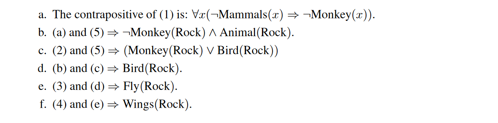

# Cumulative Reasoning With Large Language Models

## Abstract 
即使大语言模型功能强大而且丰富, 他们在解决高度复杂问题上仍然不太行. 这是因为解决负载问题需要自由的思考, 但这在训练过程中很少被指导. 在本文中, 我们提出一种新的方法被称为==累计推理/Cumulative Reasoning==, 以累计/迭代的方式来模仿人类思考的过程. 通过讲任务分解为多个小的成分，CR可以讲问题解决过程流水线化，使得其更加的可管理和高效. CR在FOLIOwiki数据集和24点游戏上比其他方法性能显著的好. 在MATH数据集上, 58.0%准确率, 新的SOTA. 

## Introduction
LLMs在困难推理问题上比较差.
我们的认知过程包括两个不同的系统, 系统1是快速的, 本能的, 情感的; 系统2是慢速的, 深思熟虑的, 逻辑的. LLMs更像是系统1.
现有方法, CoT, ToT等等. 然而这些方法都没有一个存储中间结果的地方, 假设所有的思维形成一个链or树, 这并没有完全捕捉到人类的思维过程. 
我们提出了CR, cumulative learning, 对思考具有更加一般的刻画. CR使用三种不同的LLM, proposer, verifier, reporter. Proposer提出潜在可能的命题, 通过一个or多个verifier验证, 而reporter决定何时停止并且报告solution.
CR显著增强了语言模型在处理复杂问题方面的能力.
实验方面, 首先使用 FOLIO wiki / AutoTNLI, 分别涉及一阶逻辑和高阶逻辑. 然后24点游戏. 然后MATH数据集

#### Example of Logic
{:weight=50 height=400}
{:weight=100 height=150}
这种推理过程不是CoT/ToT, 而是图
> 对此表示反对, 依然是CoT啊, 推理过程就是一步一步的. 
> 不过, 如果推理步骤出错了, 如何回退是一个问题.
> Remark: CR就是能够回退, 这一点确实比CoT强很多. 

## Method
#### Cumulative Reasoning
三个类型的LLMs:
* proposer: 基于当前的context, 提出下一步;
* verifier(s): 这个模型会仔细审查proposer提出的步骤的准确性, 如果是正确的, 则会加入到context中;
* reporter: 通过评估当前的条件是否能直接得到最终的答案, 决定推理过程是否结束

#### 与CoT/ToT的比较
CR明显是对CoT的一种泛化, 如果没有verifier, proposer一直提出下一步, 指导结束. 但由于CR中, 整体的思维过程可以是一个有向无环图, 所以可以解决更加复杂的问题.
ToT和CR看起来很像, 但是CR会将历史上所有的正确的推理结果存放在内存中.
> 所以CR到底是DFS还是BFS呢, BFS必然是不行的吧, 因为分支数目过多. 但是DFS也只有当前这一条可能正确的推理路径.

## Experiments
#### Setting
- GPT3.5-turbo
- GPT4
- LLaMA-13B
- LLaMA-65B
CR中Proposer / Verifier / Reporter使用相同的LLM, 不同的prompt. 未来可以考虑特定任务语料上训练的Proposer, 使用形式逻辑系统辅助的Verifier

#### FOLIO wiki
{:weight=0, height=350}
#### FOLIO wiki curated

#### Auto TNLI
Tabular Natural Language Inference. 可以视为高阶逻辑推理数据集.
{:weight=0 height=200}
#### 24点
#### MATH
{:weight=0 height=350}
分别比较了CoT / Complex CoT / CR 以及 w / wo PHP(progressive hint prompt)
