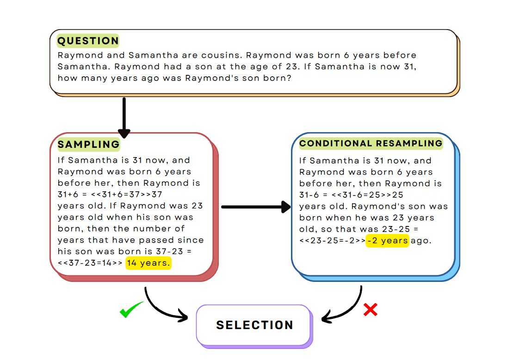
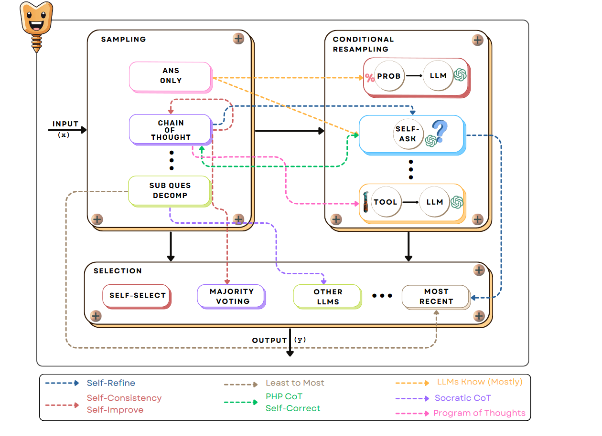

# SCREWS: A MODULAR FRAMEWORK FOR REASONING WITH REVISIONS

## Introduction
大语言模型被证明在许多推理任务上有效。然后LLMs并不总能在第一步就做对，所以需要迭代优化输出来保证能达到想要的目标。这些==refine methods==假定后续的输出会变得更好，然后这并不一定。这促使了一种==selection strategy==，可以选择更早的输出。
{:weight="400", height="400"}
此外，过去的迭代优化工作总是假定单个固定的推理策略。然后人类的推理策略式多种多样。因此，我们提出了一种==modular==的回答优化方法，允许我们测试不同的策略。
本文中，我们提出SCREWS，一个使用==回滚/revision==的用于推理的模块。下图中显示了3个主要模块，采样Sampling，条件采样Conditional Resampling，以及选择Selection. 对于一个给定的任务和输入序列，我们通过固定每个模块的子模块来实例化SCREWS（eg. 选择COT用于采样）

sampling生成的输入会被输入到conditional sampling中，该模块决定是否生成一个基于初始样本的revision. 最后，所有的样本和修订都提供给Selection模块, 它会从中选择最好的一个. 由于我们的算法具有模块化的特性, 最近提出的一些方法可以使用我们的框架进行提升. 一个例子就是将 self-refinement 方法与我们的基于模型的选择策略相结合,提高整体性能.
在多个推理任务上进行评估: 算数推理, 多条问答, code debug.

## BackGround
#### Sampling
让LLM生成一系列中间步骤对于推理步骤是十分有效的.现有方法包括:
- COT
- QuestionDecomposition: 将主要问题分解为若干个简单的小问题.
#### Conditional Resampling
使用反馈来提高生成的效果, 也是一种常见的方法. Feedback的来源有很多, 包括人类, reward model, 其他工具比如code interpreter 或者其他LLMs. 然而, 即使feedback是绝对可靠的, 使用feedback优化答案仍然有可能引入新的错误.
#### Selection
- 采样最后一个: 可能导致错误修订
- 对结果排名, marjority voting 
他们通常采用均匀采样, 本paper扩展到异质采样

## Methodology
给定问题 x, 目标输出回答 a/
所有方法本质是一个/多个随机函数 $\psi$
通常的方法是给定一个prompt, 然后让大语言模型对这个prompt进行随机续写. prompt有时会包含一些例子(也就是 few-shot)
#### Sampling
- Answer only
- CoT
- Sub Qusestion Decomposition
#### Conditional Resampling 
从sampling模块出来的结果被称为==临时结果/provisional result==将会传递给Conditional resampling模块判断是否要进行修订. 
分为两步，先判断是否要修订，如果需要，则使用上述的sampling方法进行重新采样，因为可能会用到刚才的结果，所以是conditional
