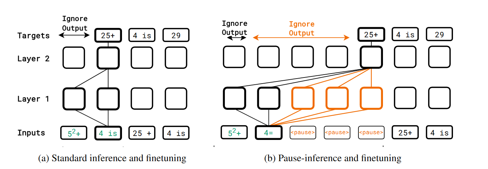
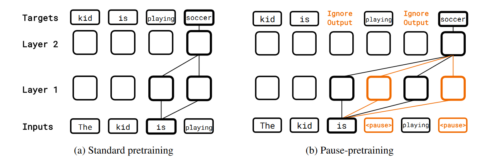
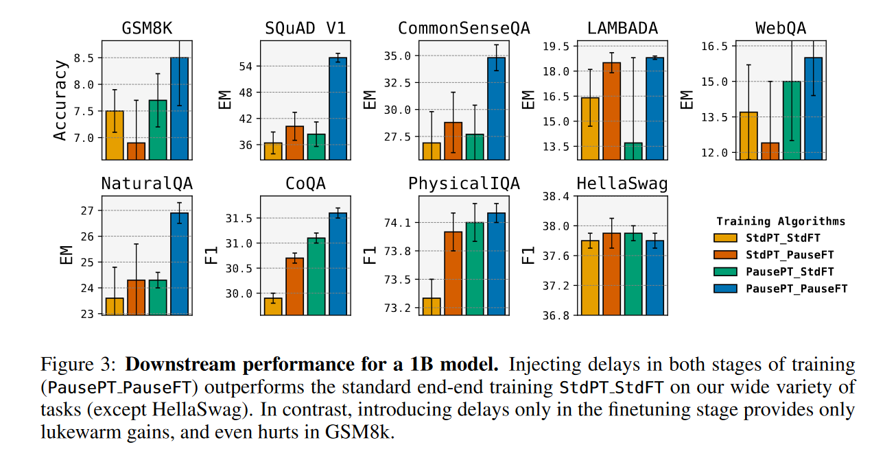
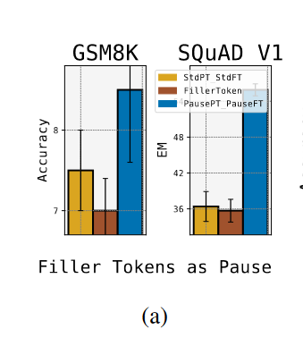

# Think before you speak: Training Language Models With Pause Tokens
通过在训练, 微调, 推理截断加入pause token, 提高了模型的性能. 作者认为是由于类似CoT的计算宽度增大.

## Motivation

## Conlcusion
- 效果好可能是由于==计算宽度增大(Enhanced computation width)==, CoT也增加了计算宽度
## Abstract
语言模型通过产生产生一个token序列的==立即后继==来生成响应:(K+1)th的token是操作前K的向量的结果, 每个向量对应一个token. 如果我们在生成k+1的token时能操作k+1个向量呢? 我们通过在训练和推理结果加入==pause token==来实现这个想法, 将这个标记序列加入到输入前缀后. 然后, 推理过程, 直到遇见最后一个暂停标记, 才提取模型的输出, 从而能在模型计算出最后答案之前进行额外的计算. 
在130M和1B的模型上进行了暂停训练, C4上进行预训练, 在推理, 问答等问题上进行评估. 返现训练和推理都使用延时时, 在多个人五人有显著提升. SQuAD上18%, CommonSenseQA上8%, GSM8K上1%.

## Introduction
大语言模型解码的过程, 无论这个过程多么复杂, 都遵循一个约束: ===确定下一个token的操作次数受到他目前看到的token数目的限制.==
我们的方法时加入虚拟token, 从而延迟模型的输出. 具体而言, 我们选择一个可学习的pause token(\<pause>)加入到输入中. 

Standard vs. pause-inference/finetuning. 考虑一个下游任务, 模型给定一个prefix, 然后模型补全. Ignore output意味着推理过程中, 响应的输出不会被提取, 然后自回归. ==在右图中, 只有第三个pause对应的输出会被被提取和用于自回归.== 微调过程中, 这些输出不会被用于反向传播, ==不计算这个输出的loss, 也就是没有标签, 不考虑这些玩意.== 
并不知道这个操作会什么样, 也许会引入==更广的推理路径==. 但也有可能什么都不发生, 比较pause不提供任何信息.
有人在推理阶段加入...的虚拟token, 但是没帮助(只在推理阶段加入, 没有在训练极端加入)
但如果在所有阶段(Pretraining/SFT/Inference)都加入呢. 该paper做了.

## Pause-training
这个想法是通过在输入中附加虚拟token来合成增加输入序列的长度, 从而将模型的输出延迟.
直觉上, 这些中间的向量可以提供更加丰富的表示, 从而时模型产生更好的下一个标记. 

#### Learning and inference with the \<pause> token
- pretraining
  - 训练时, 在句子中插入\<pause>, 然后在非\<pause>对应的输出计算loss, \<pause>对应的输出不计算loss
  - 只是希望pause作为强制模型计算延时的方式, 而不要求模型输出这些.
- fine-tuning
  - 任务, 给定prefix $P_{1:N}$, label是$t_{1:T}$.
  - 在prefix后面添加M个pause标记 -> $P_{1:N+M}$
  - 然后在traget上使用next word prediction loss
- Inference
  - 在prefix上后加入$M_{inf}$个\<pause>.
#### Pause-Training的变体
- Standard-pre + standard-ft
- standard-pre + pause-ft
- pause-pre + standard-ft
- pause-pre + pause-ft

## Experiments
- pause有帮助吗
- 不同阶段注入有区别吗
#### Setup
decoder-only模型; 130M/1B; C4上预训练, 添加10%的pause, 然后截断到原来长度;  200B token.
测试了ft和inference阶段, 插入的pause的数目的影响.
#### Dataset
- Reasoning: GSM8K
- QA: SQuAD, CoQA
- understanding: CommonSenseQA, PhysicalIQA
- long context recall: LAMABADA
- NLI: HellaSwag
- fact recall: WebQuestion, Natural Qusetions
#### Effectiveness

- pause-pre+pause-ft 在多个任务上表现好于 standard-pre+standard-ft
- standard-pre+pause-ft 在一些任务上有一些表现, 但是一些任务上表现比较差
- pause-pre+standard-ft在一些任务上有较好的提升, 相比于不在上游任务上进行pause训练. 所有这些提升可能主要来自于pause-pre
{:height=0 width=100}
- 只在推理阶段加入"...", 性能不如不加

所以关键是什么时候加入延迟, pause-pretraining > pause-sft > pause-inference. 不加pause的预训练模型在剩下阶段加入inference不太好.

## Ablation
- num of pause token during fine-tuning
  - GSM8K上10个token最佳, 50会降低到baseline
  - SQuAD上10不是最佳
- num of pause token during inference and Robustness
  - pause-pre+pause-ft鲁棒性比较好, 即使inference的数目只有ft的一半, 效果也被baseline好.
  - standard-pre+pause-pre更好
  - 理想情况下, 当inference阶段没有pause token, 那么pause-ft的模型应该和standard-ft模型的性能能一样, 但是, 在pause-pre+pause-ft模型上不加pause性能会显著下降.

## Discussion
- 效果好可能是由于==计算宽度增大(Enhanced computation width)==. 
- CoT也增大了计算宽度.
- 不增加参数量, 还能够提高性能